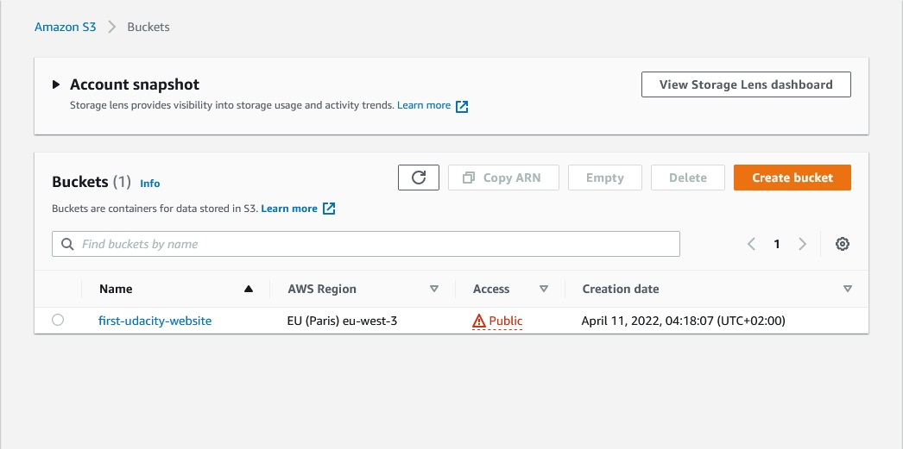
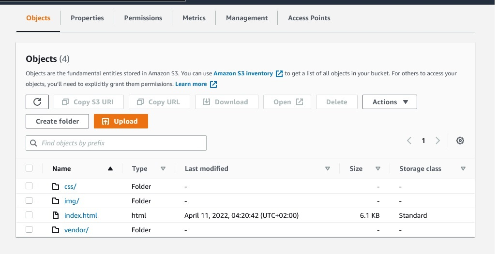
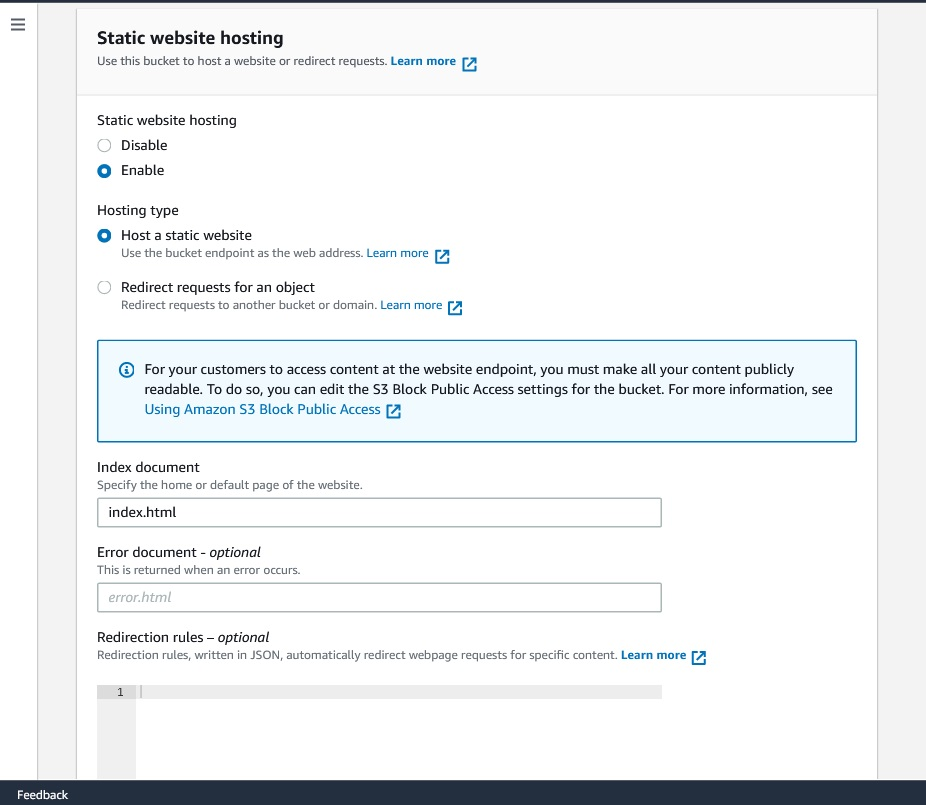
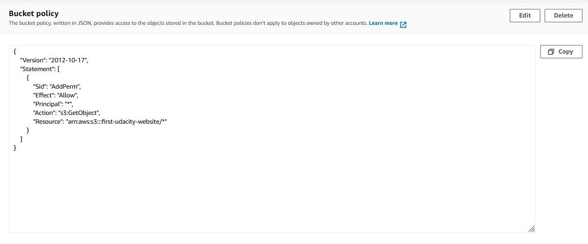
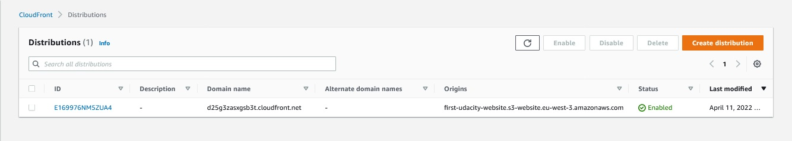

# Udacity DevOps
# Project 1 :Deploy Static Website on AWS
## Table Of Contents
* [Project 1 :Deploy Static Website on AWS](#project-1-deploy-static-website-on-aws)
  * [1- Website Files](#1--website-files-)
    * [1-The S3 bucket is created.](#1-the-s3-bucket-is-created)
    * [2-all the website Files uploaded to the newly created S3 bucket.](#2-all-the-website-files-uploaded-to-the-newly-created-s3-bucket-)
    * [3- The S3 bucket is conFigured to support static website hosting.](#3--the-s3-bucket-is-configured-to-support-static-website-hosting-)
    * [4- The S3 bucket has an IAM bucket policy that makes the bucket contents publicly accessible.](#4--the-s3-bucket-has-an-iam-bucket-policy-that-makes-the-bucket-contents-publicly-accessible-)
    
  * [2- Website Distribution](#2--website-distribution-)
    * [CloudFront has been conFigured to retrieve and distribute website Files.](#cloudfront-has-been-configured-to-retrieve-and-distribute-website-files-)
  * [3- Access Website In Web Browser](#3--access-website-in-web-browser-)
    * [1-Access the`https` secured website **without appending** `/index.html` at the end: `https://d25g3zasxgsb3t.cloudfront.net`](#1--open-a-web-browser-like-google-chrome-and-paste-the-copied-cloudfront-domain-name-httpsd25g3zasxgsb3tcloudfrontnet-without-appending-indexhtml-at-the-end-the-cloudfront-domain-name--httpsd25g3zasxgsb3tcloudfrontnet-show-the-content-of-the-default-home-page-as-shown-below-)
    * [2- Access the website via website-endpoint:`http://first-udacity-website.s3-website.eu-west-3.amazonaws.com/`](#2--access-the-website-via-website-endpointhttpfirst-udacity-websites3-websiteeu-west-3amazonawscom-)
    * [3- Access the bucket object via its S3 object URL:`https://first-udacity-website.s3.amazonaws.com/index.html`](#3--access-the-bucket-object-via-its-s3-object-url-httpsfirst-udacity-websites3amazonawscomindexhtml-)
    
# Project 1 :Deploy Static Website on AWS
 In this project,will deploy a static website to AWS.

 # 1- Website Files [🔝](#udacity-devops)
 ## 1-The S3 bucket is created.

 

 
 

 ## 2-all the website Files uploaded to the newly created S3 bucket. [🔝](#udacity-devops)
 

 
 

 ## 3- The S3 bucket is conFigured to support static website hosting. [🔝](#udacity-devops)

 
 
  
 

### 4- The S3 bucket has an IAM bucket policy that makes the bucket contents publicly accessible. [🔝](#udacity-devops)

 

 
 

# 2- Website Distribution [🔝](#udacity-devops)

 ## CloudFront has been conFigured to retrieve and distribute website Files. [🔝](#udacity-devops)

 
 
  
 

# 3- Access Website in Web Browser [🔝](#udacity-devops)

## 1- Open a web browser like Google Chrome, and paste the copied CloudFront domain name (`https://d25g3zasxgsb3t.cloudfront.net`) **without appending** `/index.html` at the end.  The CloudFront domain name  `https://d25g3zasxgsb3t.cloudfront.net/` show the content of the default home-page, as shown below: [🔝](#udacity-devops)

The figure above shows the page displayed at: 

> https://d25g3zasxgsb3t.cloudfront.net/

 
 

## 2- Access the website via website-endpoint:`http://first-udacity-website.s3-website.eu-west-3.amazonaws.com/` [🔝](#udacity-devops)

The figure above shows the page displayed at:

> http://first-udacity-website.s3-website.eu-west-3.amazonaws.com/

 
 

## 3- Access the bucket object via its S3 object URL: `https://first-udacity-website.s3.amazonaws.com/index.html` [🔝](#udacity-devops)

The figure above shows the page displayed at:

> https://first-udacity-website.s3.amazonaws.com/index.html
 
 

# [🔝](#udacity-devops)
 
 

***[GitHub Link](https://github.com/mohamedelfal/UdacityDevOps/)***
