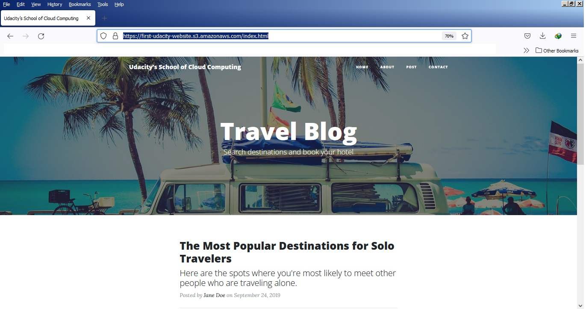

# Udacity DevOps
## 1- Website Files
### The S3 bucket is created.

### 2-all the website Files uploaded to the newly created S3 bucket.

### 3- The S3 bucket is conFigured to support static website hosting.

### 4- The S3 bucket has an IAM bucket policy that makes the bucket contents publicly accessible.

## 2- Website Distribution

### CloudFront has been conFigured to retrieve and distribute website Files.

## 3- Access Website in Web Browser

### 1- Open a web browser like Google Chrome, and paste the copied CloudFront domain name (such as, d25g3zasxgsb3t.cloudfront.net) without appending /index.html at the end. The CloudFront domain 

name should show you the content of the default home-page, as shown below:
>> https://d25g3zasxgsb3t.cloudfront.net/

The figure above shows the page displayed at >> https://d25g3zasxgsb3t.cloudfront.net/

### 2- Access the website via website-endpoint, such as http://first-udacity-website.s3-website.eu-west-3.amazonaws.com/

>>http://first-udacity-website.s3-website.eu-west-3.amazonaws.com/

The figure above shows the page displayed at >> http://first-udacity-website.s3-website.eu-west-3.amazonaws.com/

### 3- Access the bucket object via its S3 object URL, such as, https://first-udacity-website.s3.amazonaws.com/index.html

The figure above shows the page displayed at >> https://first-udacity-website.s3.amazonaws.com/index.html

